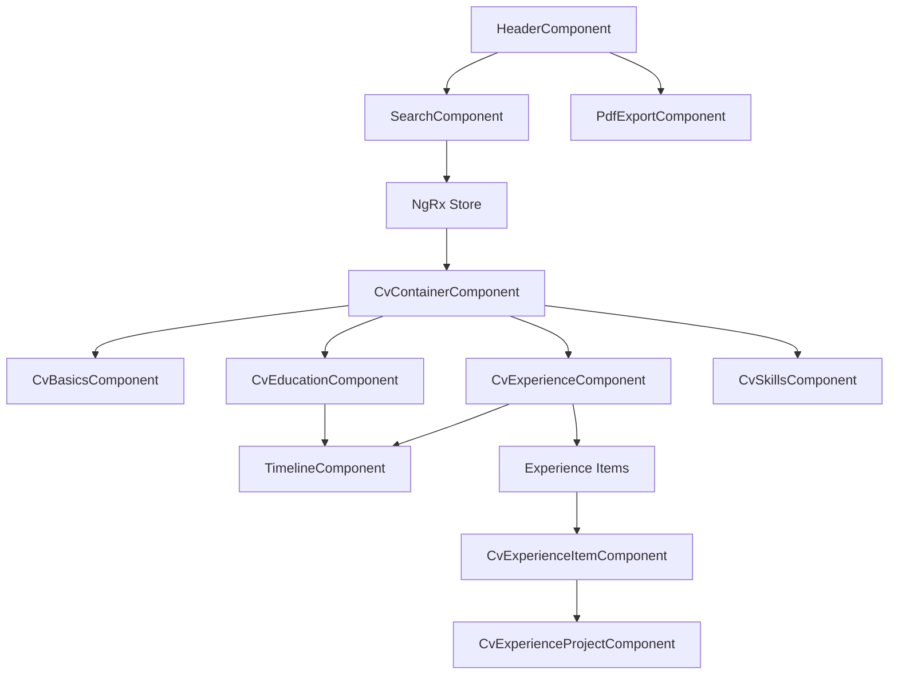

# Component Analysis

## Data Flow

## Component Responsibilities

### Smart Components
1. `CvContainerComponent`
   - State Management
     * Subscribes to store for CV data
     * Handles filtering logic
   - Data Distribution
     * Passes filtered data to child components
   - Layout Management
     * Responsive layout adjustments
     * Print layout coordination

### Presentational Components
1. `CvBasicsComponent`
   - Input Properties:
     * basics: CvBasics
     * isFiltered: boolean
   - Responsibilities:
     * Display title and summary
     * Show highlight points
     * Highlight search matches

2. Experience Components:
   a. `CvExperienceItemComponent`
   - Input Properties:
     * company: Company
     * position: Position
     * filterTerm: string
   - Responsibilities:
     * Show company and position details
     * Display responsibilities
     * Manage projects list
     * Handle filtering matches

   b. `CvExperienceProjectComponent`
   - Input Properties:
     * project: Project
     * filterTerm: string
   - Responsibilities:
     * Show project details and role
     * Display technologies and achievements
     * Handle filtering matches

3. `CvEducationComponent`
   - Input Properties:
     * education: Education[]
     * certifications: Certification[]
     * filterTerm: string
   - Responsibilities:
     * Show education history
     * Display certifications
     * Handle filtering

4. `CvSkillsComponent`
   - Input Properties:
     * skills: Skills
     * filterTerm: string
     * viewMode: 'grid' | 'list'
   - Responsibilities:
     * Display skill categories
     * Handle filtering
     * Support view switching

### Shared Components

1. `SearchComponent`
   - Input Properties:
     * initialFilters: Filter[]
     * sections: Section[]
   - Output Properties:
     * searchChange: EventEmitter<SearchCriteria>
   - Responsibilities:
     * Handle search input
     * Manage active filters
     * Section toggling

2. `TimelineComponent`
   - Input Properties:
     * items: TimelineItem[]
     * highlights: string[]
   - Responsibilities:
     * Display timeline
     * Show filtered periods
     * Handle navigation

3. `PdfExportComponent`
   - Input Properties:
     * sections: Section[]
     * currentFilter: Filter[]
   - Responsibilities:
     * Configure export
     * Handle generation
     * Manage download

## State Updates

### Search Flow
1. User updates search or filters
2. SearchComponent emits criteria
3. Store updates filters
4. Components receive updates
5. UI updates to show matches

### PDF Export Flow
1. User configures export
2. Store triggers generation
3. UI shows progress
4. Download starts

## Component Communication
- Through NgRx store for global state
- Via inputs/outputs for parent-child
- Services for shared functionality

## Error Handling
- Component error states
- Global error handler
- User feedback
- Recovery options

## Accessibility
- ARIA roles and labels
- Keyboard navigation
- Screen reader support
- Focus management